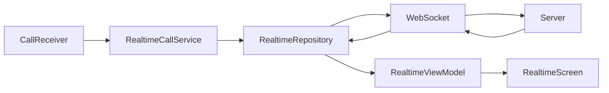
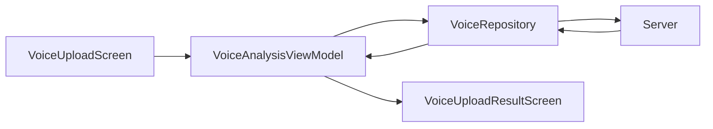
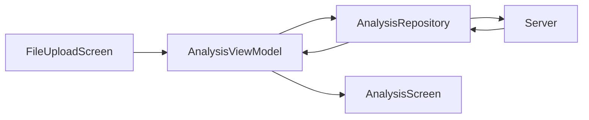
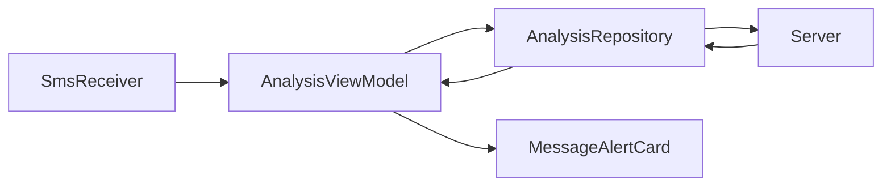
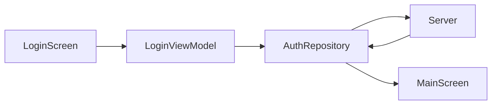

# 📱 Anti-Phishing Android App

본 레포지토리는 **Anti-Phishing Android 애플리케이션**의 클라이언트(App) 코드입니다.  
Jetpack Compose 기반 UI와 **MVVM + Repository 패턴**을 적용하여  
보이스 피싱 · 스미싱 · 악성 전화 탐지를 위한 구조화된 아키텍처로 설계되었습니다.

---

## 📁 Project Structure

본 프로젝트는 **기능 단위(feature) 분리**와 **관심사 분리(SoC)** 를 중심으로 구성되어 있습니다.

```text
app/
└── src/main/java/com/example/antiphishing/
    ├── data/                  # 데이터 계층 (Local / Repository)
    │   └── local/
    │       └── LocalDatabase.kt        # 로컬 DB 설정
    │
    ├── feature/               # 주요 기능 단위 모듈
    │   ├── model/             # API / Domain 모델
    │   │   ├── AnalysisResponse.kt       # 문서/이미지 분석 결과 응답 DTO
    │   │   ├── AuthData.kt               # 로그인/회원가입 요청 데이터 DTO
    │   │   ├── AuthResponse.kt           # 인증 응답 DTO(토큰/유저정보 등)
    │   │   ├── RealtimeMessage.kt        # WebSocket 수신 메시지 DTO
    │   │   ├── SuspiciousItem.kt         # UI 의심근거(문구) 리스트용 data class
    │   │   ├── VoiceData.kt              # 음성 분석 API 응답 DTO 묶음
    │   │   └── VoiceResult.kt            # UI 표시용 결과
    │   │
    │   ├── realtime/          # 실시간 통신(WebSocket)
    │   │   ├── RealtimeCallService.kt     # 마이크 PCM(16kHz) 실시간 서버 Websocket 전송
    │   │   └── WebSocketClient.kt         # WebSocket 연결/송수신 및 RealtimeMessage 파싱
    │   │
    │   ├── repository/        # Feature 단위 Repository
    │   │   ├── AnalysisRepository.kt      # 문서/이미지 분석 API 요청
    │   │   ├── AuthRepository.kt          # 인증 토큰 저장 및 로그인 상태 관리
    │   │   ├── RealtimeRepository.kt      # WebSocket 연결 및 실시간 메시지 송수신
    │   │   └── VoiceRepository.kt         # 음성 파일 업로드 및 분석 결과 파싱
    │   │
    │   └── viewmodel/         # ViewModel (상태 관리)
    │       ├── AnalysisViewModel.kt       
    │       ├── AuthViewModel.kt           
    │       ├── LoginViewModel.kt
    │       ├── RealtimeViewModel.kt
    │       ├── SignUpViewModel.kt
    │       ├── SocialLoginViewModel.kt
    │       └── VoiceAnalysisViewModel.kt
    │
    ├── network/               # 네트워크 계층
    │   ├── ApiClient.kt       # Retrofit Client
    │   ├── ApiService.kt      # API Interface
    │   └── AppConfig.kt       # 서버 설정
    │
    ├── receiver/              # 시스템 이벤트 수신
    │   ├── CallReceiver.kt    # 전화 수신 감지
    │   └── SmsReceiver.kt     # SMS 수신 감지
    │
    ├── ui/                    # UI 계층 (Jetpack Compose)
    │   ├── components/        # 재사용 UI 컴포넌트
    │   │   ├── MessageAlertCard.kt
    │   │   └── PhoneAlertCard.kt
    │   │
    │   ├── main/
    │   │   └── MainScreen.kt  # 메인 화면
    │   │
    │   └── navigation/
    │       └── AppNavGraph.kt # 화면 전환 관리
    │
    ├── screen/                # Activity 단위 화면
    │   ├── AlertActivity.kt
    │   └── MainActivity.kt
    │
    ├── theme/                 # 앱 테마
    │   ├── Color.kt
    │   ├── Theme.kt
    │   └── Type.kt
    │
    ├── utils/                 # 유틸리티
    │   ├── FileUtils.kt
    │   ├── NotificationHelper.kt
    │   ├── SaltKeeper.kt
    │   └── Sanitizer.kt
    │
    └── MyApplication.kt       # Application 클래스
```

---

## 🔄 Overall Feature Flow

### 📞 실시간 통화 탐지 흐름 (WebSocket 기반)
#### 📊 Realtime Call Detection Flow


```text
CallReceiver.kt
 → RealtimeCallService.kt
 → RealtimeRepository.kt
 → WebSocket
 → Server(STT + 피싱 분석)
 → RealtimeRepository.kt
 → RealtimeViewModel.kt
 → RealtimeScreen.kt
```
- **CallReceiver.kt**  
  전화 수신 이벤트 감지 후 실시간 탐지 서비스 시작
- **RealtimeCallService.kt**  
  마이크 PCM(16kHz) 녹음 후 실시간으로 서버 WebSocket 전송
- **RealtimeRepository.kt**  
  WebSocket 연결 관리 및 실시간 메시지 수신
- **RealtimeViewModel.kt**  
  분석 메시지를 UI 상태로 변환
- **RealtimeScreen.kt**  
  실시간 자막 및 위험 경고 표시

---

### 🎙 음성 파일 업로드 분석 흐름
#### 📊 Voice File Analysis Flow


```text
VoiceUploadScreen.kt
→ VoiceAnalysisViewModel.kt
→ VoiceRepository.kt
→ Server
→ VoiceAnalysisViewModel.kt
→ VoiceUiResult
→ VoiceUploadResultScreen.kt
```

- **VoiceUploadScreen.kt**  
  음성 파일 선택 및 업로드
- **VoiceAnalysisViewModel.kt**  
  서버 응답을 UI 결과로 가공
- **VoiceRepository.kt**  
  음성 파일 Multipart 변환 및 업로드
- **VoiceUploadResultScreen.kt**  
  분석 결과 표시

---

### 📑 문서 캡처 이미지 분석 흐름 (위조 문서 분석)
#### 📊 Document Image Analysis Flow


```text
FileUploadScreen.kt
→ AnalysisViewModel.kt
→ AnalysisRepository.kt
→ Server
→ AnalysisViewModel.kt
→ AnalysisScreen.kt
```

- **FileUploadScreen.kt**  
  문서/이미지 캡처 또는 선택
- **AnalysisRepository.kt**  
  이미지 분석 API 요청
- **AnalysisScreen.kt**  
  분석 결과 시각화

---

### 📩 SMS 스미싱 분석 흐름
#### 📊 SMS Phishing Analysis Flow


```text
SmsReceiver.kt
→ AnalysisViewModel.kt
→ AnalysisRepository.kt
→ Server
→ AnalysisViewModel.kt
→ MessageAlertCard.kt
```

- **SmsReceiver.kt**  
  문자 수신 이벤트 감지
- **AnalysisRepository.kt**  
  문자 내용 분석 요청
- **MessageAlertCard.kt**  
  위험 문자 알림 표시

---

### 🔐 로그인 / 토큰 관리 흐름
#### 📊 Login and Token Flow


```text
LoginScreen.kt
→ LoginViewModel.kt
→ AuthRepository.kt
→ Server
→ AuthRepository.kt
→ MainScreen.kt
```

- **LoginScreen.kt**  
  로그인 정보 입력
- **AuthRepository.kt**  
  토큰 저장 및 자동 로그인 관리
- **MainScreen.kt**  
  로그인 성공 후 메인 화면 진입

---

## 🛠 Tech Stack

- **Language**: Kotlin
- **UI**: Jetpack Compose, Material3
- **Architecture**: MVVM, Repository Pattern
- **Network**: Retrofit, WebSocket
- **Async**: Coroutine, Flow
